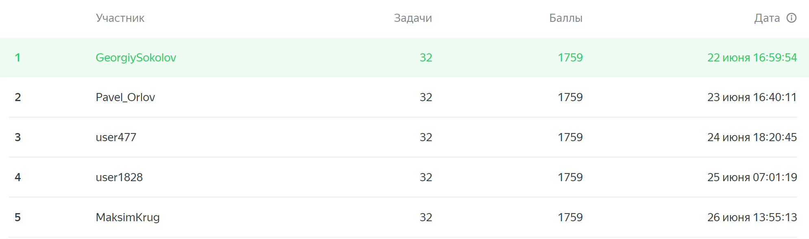
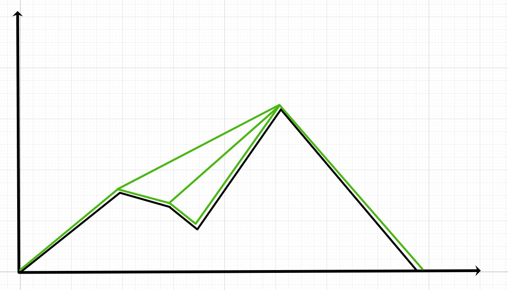
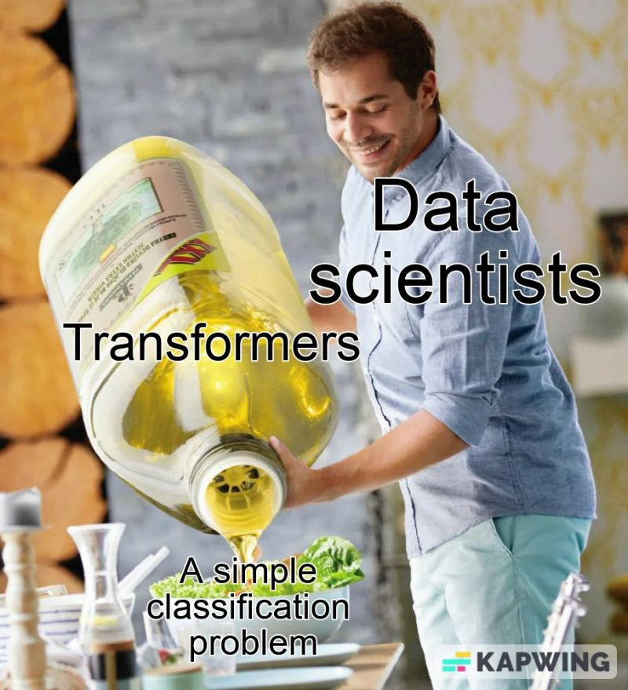

# CodeRun ML-track 1st season solutions

Этот репозиторий содержит решения всех задач ML-трека 1 сезона CodeRun, а также небольшие текстовые разборы решений и подсказки к решениям.

Мне довелось поучаствовать в данном соревновании и достичь неплохих результатов. Топ-5, в котором мой результат выделен зеленым:

Ниже я постарался написать небольшие подсказки/темы для изучения, которые помогут в решении и понимании конкретной задачи. Сами решения и их короткие описания вы сможете найти в jupyter-блокнотах внутри соответствующих папок.
Нумерация задач в репозитории соответствует нумерации в системе CodeRun на момент создания репозитория.

Хочу отдельно поблагодарить всех, кто участвовал в обсуждениях задач, подсказывал и направлял, коллег и организаторов CodeRun.

Быстрые переходы к подсказкам по задачам и ссылкам на решения:

- [156. Опечатки (средняя)](#156-опечатки)
- [161. Генератор точек в круге (средняя)](#161-генератор-точек-в-круге)
- [163. Сумма на гранях (средняя)](#163-сумма-на-гранях)
- [171. Коллекция статуэток (средняя)](#171-коллекция-статуэток)
- [177. Тайна египетских пирамид (средняя)](#177-тайна-египетских-пирамид)
- [178. Решающий пень (легкая)](#178-решающий-пень)
- [184. Восстановление коэффициентов (легкая)](#184-восстановление-коэффициентов)
- [200. Разминка (средняя)](#200-разминка)
- [207. Обобщённый AUC (средняя)](#207-обобщённый-auc)
- [209. Перестановки (средняя)](#209-перестановки)
- [214-327. Рестораны и Рестораны 2.0 (сложная)](#214-327-рестораны)
- [221. Линейно разделимая выборка (средняя)](#221-линейно-разделимая-выборка)
- [224. Уникальные запросы (средняя)](#224-уникальные-запросы)
- [233. Ранжирование по парам (средняя)](#233-ранжирование-по-парам)
- [240. Монетки (средняя)](#240-монетки)
- [243. Рекомендательная система SVD (средняя)](#243-рекомендательная-система-svd)
- [262. Лента рекомендаций (сложная)](#262-лента-рекомендаций)
- [266. Кластеризация символьных последовательностей (сложная)](#266-кластеризация-символьных-последовательностей)
- [271. Интерполяция (средняя)](#271-интерполяция)
- [282. D-Cov-3999 (средняя)](#282-d-cov-3999)
- [283. Канатная дорога (легкая)](#283-канатная-дорога)
- [288. Оптимальная константа (легкая)](#288-оптимальная-константа)
- [297. Исчезнувшая (средняя)](#297-исчезнувшая)
- [301. Бутылки рома (средняя)](#301-бутылки-рома)
- [312. Иннокентий и друзья (сложная)](#312-иннокентий-и-друзья)
- [314. Оптимальная константа 2.0 (легкая)](#314-оптимальная-константа-2-0)
- [318. Многорукий бандит (сложная)](#318-многорукий-бандит)
- [322. Безградиентная оптимизация функции (средняя)](#322-безградиентная-оптимизация-функции)
- [373. Омографы (сложная)](#373-омографы)
- [382. Предсказание погоды (средняя)](#382-предсказание-погоды)
- [384. Звёздные карты 2.0 (средняя)](#384-звёздные-карты-20)

# 156. Опечатки

- Подумайте как получить одно слово из другого с заданным набором ошибок, если знаем, что ошибка только одна.
- На втором шаге начальных слов просто больше чем было на первом этапе с 1 ошибкой.
- Необязательно идти от одного слова к другому, можно заставить их идти навстречу друг другу.

[Решение](156.Опечатки/Опечатки.ipynb)
# 161. Генератор точек в-круге

- Визуализируйте некоторое среднее количество точек (100 - мало, 100 000 - много) на двух разных графиках и посмотрите что различается.
- Проверьте статистики выборок генерируемых 1 и 2 генераторами, можно попробовать построить доверительные интервалы для них.

[Решение](161.ГенераторТочекВКруге/ГенераторТочекВКруге.ipynb)
# 163. Сумма на гранях

- Решение можно вывести аналитически.
- Попробуйте порисовать решения для простых вариантов. Что меняется при усложнении? При увеличении k? Что если $a_1=a_2=...=a_6$, а в других случаях?

[Решение](163.СуммаНаГранях\СуммаНаГранях.ipynb)
# 171. Коллекция статуэток

- Почитайте про скользящее окно.

Вот несколько ссылок на задачи, которые могут помочь в решении:
- [Самая длинная подстрока без повторения символов.](https://leetcode.com/problems/longest-substring-without-repeating-characters/)
- [Подмассивы с K различными целыми числами.](https://leetcode.com/problems/subarrays-with-k-different-integers/)

[Решение](171.КоллекцияСтатуэток/КоллекцияСтатуэток.ipynb)
# 177. Тайна египетских пирамид

- Внимательно изучите линейную регрессию для простейших случаев. Как там восстанавливаются коэффициенты?
- Необязательно считать производные аналитически, когда существуют численные методы.
- Посмотрите библиотеку scipy.optimize.

[Решение](177.ТайнаЕгипетскихПирамид/ТайнаЕгипетскихПирамид.ipynb)
# 178. Решающий пень

- Какие значения считаются оптимальными, когда в лист решающего дерева для регрессии попадает несколько объектов (для MSE)? Тогда какие a и b?
- Как быстро считать ошибку для левой и правой выборок (относительно C) при перемещении элемента из одной выборки в другую?
- Остается пройтись по всем числам и выбрать параметры для минимальных значений ошибок.

[Решение](178.РешающийПень\РешающийПень.ipynb)
# 184. Восстановление коэффициентов

- Внимательно изучите линейную регрессию для простейших случаев. Как там восстанавливаются коэффициенты?
- Необязательно считать производные аналитически, когда существуют численные методы.
- Посмотрите библиотеку scipy.optimize.

[Решение](184.ВосстановлениеКоэффициентов/ВосстановлениеКоэффицентов.ipynb)
# 200. Разминка

- Линейная регрессия.

[Решение](200.Разминка/Разминка.ipynb)
# 207. Обобщённый AUC

- Может пройти $O(N^2)$, но прямой полный перебор не пройдёт. Необходимо чуть "умнее" выбирать сколько элементов меньше, сколько равны.

Подсказки от [Муравьева Вячелава](https://github.com/Slamur/) из команды организаторов (ожидавшееся авторское решение за $O(NlogN)$):

В задаче требуется найти количество пар i, j таких, что
- $t[i] < t[j]$
- $y[i] < y[j]$ или $y[i] = y[j]$ (отдельные вычисления)

Сначала решим задачу про $y[i] = y[j]$
- Допустим, что все y равны между собой. Как найти количество пар эффективнее $O(N^2)$?
- Пусть все $Т$ уникальны и отсортированы по неубыванию. Сколько элементов образуют пару с $t[i]$? Где расположены эти элементы?
- А как изменяется задача, когда есть равные $Т$?
- Как относится задача с одинаковыми $Y$ к оригинальной задаче?

Теперь для $y[i] < y[j]$:
- Заменим $y[i]$ на $-y[i]$ (теперь ищем $t[i] < t[j]$, $y[i] > y[j]$). Напоминает ли это какую-то известную задачу?
- Допустим, что все $Т$ уникальны. Отсортируем пары $(T, Y)$ по неубыванию $Т$ и перенумеруем.
  В таком случае задача свелась к количеству пар ($i < j$, $y[i] > y[j]$) - инверсий в массиве.
- Как изменить алгоритм поиска с учетом неуникальности $Т$? Может быть выбрать какое-то правило сравнения $Y$ при равенстве $T$?

Немного про поиск количества инверсий:
- Пусть у вас есть два отсортированных по возрастанию массива $А$ и $B$. Как за $O(N)$ получить отсортированный массив, являющийся объединением $А$ и $B$?
- А как найти количество пар $(i, j)$ таких, что $A[i] > B[j]$ за $O(|A| + |B|)$ в процессе объединения?
- Пусть $B[k] < A[i] <= B[k + 1]$. Сколько в таком случае пар $A[i] > B[j]$?
- Пусть массивы $A$ и $B$ - левая и правая половины массива Y. Как решить задачу через сведение к подобным?

[Решение](207.ОбобщенныйAUC/ОбобщенныйAUC.ipynb)
# 209. Перестановки

- Обычные статистики не сработают.
- Частоты появлений символов важны, визуализация и heatmap.

[Решение](209.Перестановки/Перестановки.ipynb)
# 214-327. Рестораны

- Достаточно минимизации функционала потерь известными методами.
- Формы распределений признаков важны для высокого качества.

[Решение](214-327.Рестораны-Рестораны2/Рестораны.ipynb)
# 221. Линейно разделимая выборка

- Какой алгоритм машинного обучения строит разделяющие гиперплоскости?
- Будет достаточно известных реализаций этого алгоритма.

[Решение](221.ЛинейноРазделимаяВыборка/ЛинейноРазделимаяВыборка.ipynb)
# 224. Уникальные запросы

- Эффективная оценка мощности большого множества
- HyperLogLog для множеств бОльших размерностей, на заданном диапазоне у него большая ошибка.
- [В этой статье хорошо описаны различные алгоритмы для оценки мощности множества.](https://habr.com/ru/companies/vk/articles/711126/)

[Решение](224.УникальныеЗапросы/УникальныеЗапросы.ipynb)
# 233. Ранжирование по парам

- Метод максимального правдоподобия.
- Логистическая регрессия через матричные представления.

[Решение](233.РанжированиеПоПарам/РанжированиеПоПарам.ipynb)
# 240. Монетки

- Необходимо предсказывать не частоту, а вероятность, что следующее испытание закончится успехом
- Правило Лапласа

[Решение](240.Монетки/Монетки.ipynb)
# 243. Рекомендательная система SVD

- Simon Funk и его подход в ML соревновании от Netflix.
- SVD для рекомендаций и градиентный спуск.
- Библиотека surprise (в компиляторе её нет, но формулы внутри её документации полезны)

[Решение](243.РекомендательнаяСистемаSVD/РекомендательнаяСистемаSVD.ipynb)
# 262. Лента рекомендаций

- Жадного подхода достаточно

[Решение](262.ЛентаРекомендаций/ЛентаРекомендаций.ipynb)
# 266. Кластеризация символьных последовательностей

- EM-алгоритм
- Цепи Маркова
- Обычные методы кластеризации вряд ли сработают (у меня не сработали)

[Решение](266.КластеризацияСимвольныхПоследовательностей/КластеризацияСимвольныхПоследовательностей.ipynb)
# 271. Интерполяция

- PolynomialFeatures
- Линейной регрессии должно хватить

[Решение](271.Интерполяция/Интерполяция.ipynb)
# 282. D-CoV-3999

- Представьте как бы вы это делали в реальной жизни, как бы вы организовали для себя эту задачу?
- В каком формате было бы удобно иметь данные?
- Правильная организация данных и выбор структур данных - ключ к решению

[Решение](282.D-CoV-3999/D-CoV-3999.ipynb)
# 283. Канатная дорога

- Изображение выше должно помочь в понимании условия. Черным нарисован силуэт хребта, а зеленым все трассы, которые необходимо построить.

!ВНИМАНИЕ ДАЛЬНЕЙШЕЕ ОБЪЯСНЕНИЕ НЕ СВЯЗАНО С РИСУНКОМ, НА РИСУНКЕ ЗАТРОНУТО БОЛЬШЕЕ КОЛИЧЕСТВО СЛУЧАЕВ ДЛЯ ЛУЧШЕГО ПОНИМАНИЯ ЗАДАЧИ
1. Все подряд идущие вершины соединены друг с другом (не важно больше следующая вершина или меньше, они соединены)
2. Дополнительно каждая вершина соединена со следующей НЕ меньшей по высоте, то есть большей либо равной по высоте. То есть у нас есть вершины 1-2-3, 1 вершина больше 2, но меньше 3. Получается впадина с вершиной 2 внизу. Мы соединяем последовательно вершины 1-2-3, а также дополнительно соединяем вершины 1 и 3.

[Решение](283.КанатнаяДорога/КанатнаяДорога.ipynb)
# 288. Оптимальная константа

- Константы для MSE и MAE широко известны, в интернете много информации.
- Что будет если вынести $\frac{1}{y_i}$ и представить в некотором другом виде? Заменить на $w_i$? Какая формула у нас получится?

[Решение](288.ОптимальнаяКонстанта/ОптимальнаяКонстанта.ipynb)
# 297. Исчезнувшая

- Хэширование позволит быстрее сравнивать строки.
- Полиномиальное хэширование (лично я не использовал, но знаю, что решение с оттенками полиномиального хэширования позволило обойти Time Limit).
- $O(N^4)$ решение не пройдёт)

[Решение](297.Исчезнувшая/Исчезнувшая.ipynb)
# 301. Бутылки рома

- Формула перестановок с повторениями.
- Как теперь получить различные строки, которые удовлетворяют формуле из 1 пункта? Разных длин и так далее.

Отдельно благодарю [Алексея Маслова](https://github.com/MaslovAleksey) за активное обсуждение данной задачи и идей её решения.

[Решение](301.БутылкиРома/БутылкиРома.ipynb)
# 312. Иннокентий и друзья

- Задача на рекомендательные системы.
- Проходит решение с использованием любых библиотек для рекомендательных систем, без каких-то сложностей.
- Может пройти и простой вариант рекомендаций) Какие бы рестораны вы рекомендовали всем без какого-то особого индивидуального подхода?

[Решение](312.ИннокентийИДрузья/ИннокентийИДрузья.ipynb)
# 314. Оптимальная константа 2.0

- Выделите самое важное в условиях, убрав всё лишнее. Попробуйте посмотреть на задачу, как на задачу 288. Оптимальная константа
- Как минимизируется любая функция?
- Функция потерь - это тоже функция, её также можно минимизировать и выразить оптимальную константу через элементы выборки.

[Решение](314.ОптимальнаяКонстанта2/ОптимальнаяКонстанта2.ipynb)
# 318. Многорукий бандит

- Известная задача, её разборы представлены в статьях, в книгах и так далее.
- Слова про бета-распределение намекают на Томпсоновское сэмплирование и Байесовскую статистику, но вроде бы могут пройти и более простые для понимания решения (я не проверял).
- [Одна из статей, рассказывающая про задачу и варианты решения](https://habr.com/ru/articles/689364/)

[Решение](318.МногорукийБандит/МногорукийБандит.ipynb)
# 322. Безградиентная оптимизация функции

- Максимум превращается в минимум добавлением минуса.
- Минимизация функций есть в библиотеке scipy, остается правильно выбрать методы и правильно настроить, чтобы не нарушать условия задачи.

[Решение](322.БезградиентнаяОптимизация/БезградиентнаяОптимизацияФункции.ipynb)
# 373. Омографы

- Классификация под соусом NLP.
- У меня без ruBERT не обошлось, но можно и (относительно) проще, работая только с эмбеддингами.

[Решение](373.Омографы/Омографы.ipynb)
# 382. Предсказание погоды

- Я знаком со временными рядами лишь в общих красках, но именно на них необходимо делать упор в данной задаче. Регрессии и прочее работают хуже в тестах к данной задаче и дают Wrong Answer.
- Пара лагов и память о далеком прошлом должны помочь.

Отдельно благодарю [Евдакова Алексея](https://github.com/eae-rus/) за активное обсуждение данной задачи и идей её решения.

[Решение](382.ПредсказаниеПогоды/ПредсказаниеПогоды.ipynb)
# 384. Звёздные карты 2.0

- Content-based image retrieval.
- Image embeddings.
- Лучше выбирать более свежие сетки для эмбеддингов.
- Существуют предобученные энкодеры изображений.
- Подойдет любой (или почти) алгоритм кластеризации.

[Решение](384.ЗвездныеКарты2.0/ЗвездныеКарты2.0.ipynb)
